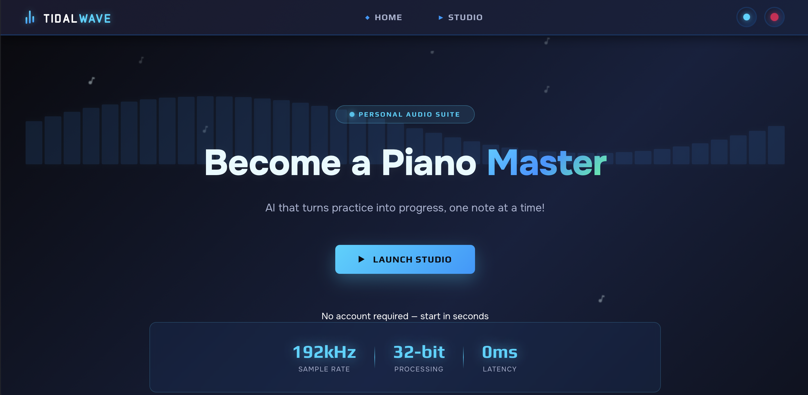
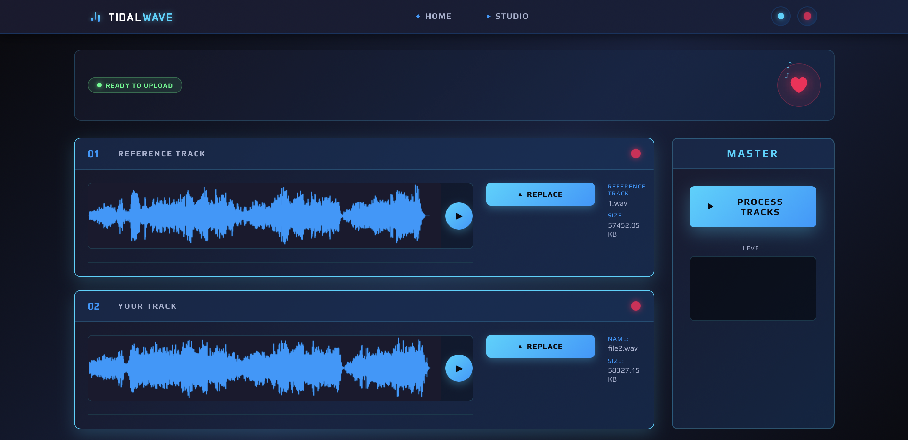

Learning piano shouldn’t mean guessing if you sound right. Our AI Piano Coach listens as you play and instantly compares your tone, loudness, and notes to a professional model performance. Using advanced audio analysis and machine learning, it highlights where your dynamics or phrasing differ, so you can see and hear exactly what to improve.

Unlike apps that just grade notes, AI Piano Coach helps you master expression — the soul of music. Whether you’re practicing a Chopin étude or a pop song, it gives real-time feedback that feels like having a personal teacher on call 24/7. It’s like having your favorite pianist guiding you, powered by AI.

